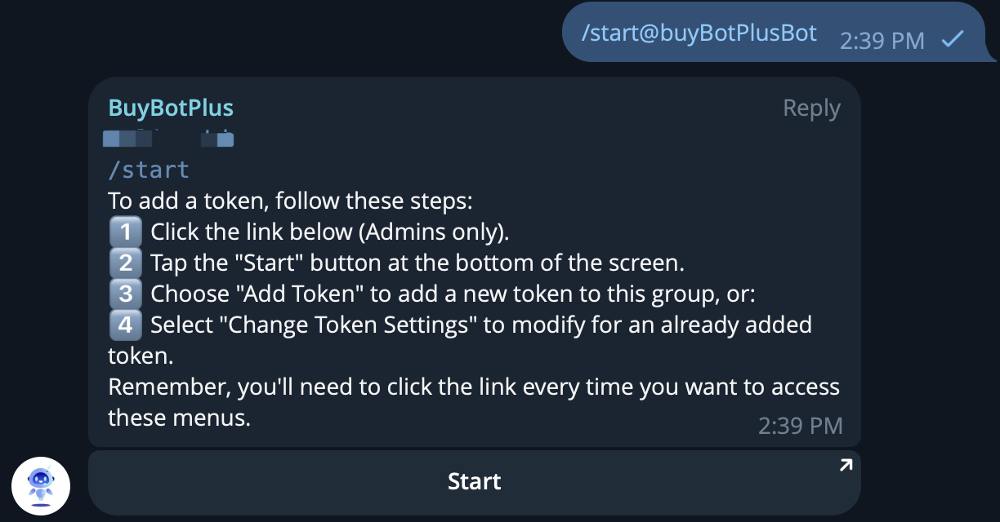

# 🥳 Custom Settings

1️⃣ **Activate the Bot:**

* Send the /start@BuyBotPlus command in the group chat to activate BuyBotPlus.
* The bot will now listen for commands and provide its menu of options.🤖

<figure><figcaption></figcaption></figure>

**2️⃣ Click Change Token Settings:**

<figure><figcaption></figcaption></figure>

**3️⃣ Choose the trading pair you want to change.**

<figure><figcaption></figcaption></figure>

4️⃣ **Set Alert Preferences:**

* Customize the alert settings by defining the minimum transaction amount for notifications and other parameters like 'whale alert' thresholds.
* Configure social and custom links to include in the alerts for added context or information.🤖

<figure><figcaption></figcaption></figure>
